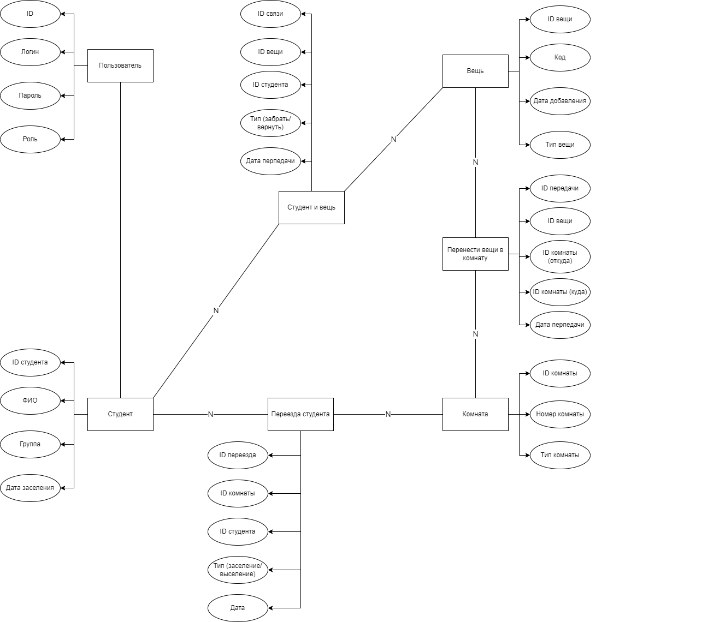
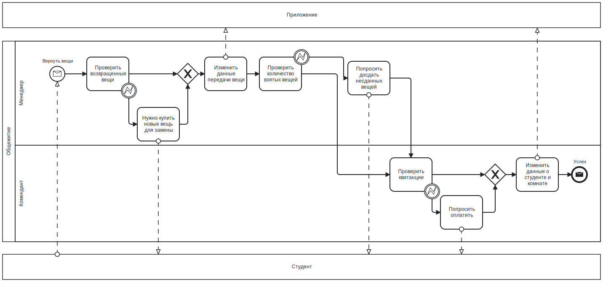

## 1. Название проекта
**Приложение для управления вещами в общежитии** 

## 2. Краткое описание идеи проекта  

В настоящее время университетские общежития во Вьетнаме используют бумажные базы данных для управления вещами, которыми используются студенты. Это затрудняет для студентов при обмене или возврате своих вещей в общежитие. Это также мешает менеджеру следить за вещами в общежитии. Поэтому я хочу создать интерактивное приложение с базой данных, чтобы упростить управление вещами в общежитии.

## 3. Краткое описание предметной области  

Предметная область - университетские общежития во Вьетнаме: регистрация студентов, добавление и изменение данных об вещей и студентах.

## 4. Краткий анализ аналогичных решений

Аналогичные решения не обнаружены, потому что во Вьетнаме до сих пор используются бумажные базы данных и управляются вручную. 

## 5. Целесообразность и актуальность проекта

Актуальность: С увеличением количества студентов, поступающих и покидающих общежитие, вещи более обильным и современным, управление вещами с бумажной базой данных становится затруднительным при современных требованиях (быстрота, точность).

Целесообразность: Интерактивное приложение с базы данных не только обеспечивает информационную безопасность, долговечность, простоту, но и предоставляет возможность обновления для удовлетворения других потребностей общежития.

## 6. Use-Case  

## 7. ER 

## 8. Пользовательские сценарии  

`Студент` имеет возможность посмотреть список взятых вещей, список студентов.

`Комендант` имеет возможность добавить/изменить/удалить данные студента, посмотреть список студентов, список всех вещей в общежитии.

`Менеджер` имеет возможность выдать/заменить/забрать вещь, добавить новую вещь, посмотреть список студентов, список всех вещей в общежитии.

### Сценарий:
1. Новый студент заселяется в общежитие. В базу данных добавляются информации о студенте и информации об вещах, выдаваемых студентам.
2. Студент хочет обменять на новую вещь. После принятия изменяются информации об вещах, выдаваемых студентам.
3. Студент хочет вернуть вещи в общежитие. После того, что менеджер забирает вещи у студента, изменяются/удаляются информации об вещах, выдаваемых студентам.
4. Студент выселяется. После подтверждения того, что студент вернул все вещи в общежитие, информация о студенте удаляется из базы данных.

## 9. BPMN 

### Заселение

### Выселение

